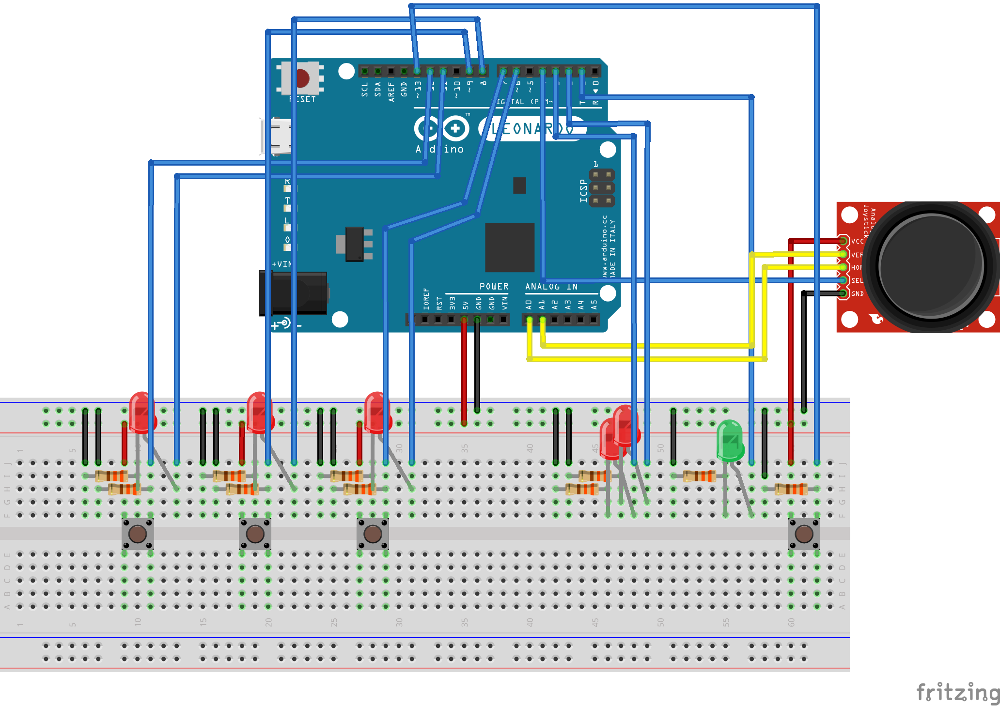

# Arduino 1010!

Implementation of the popular game "1010!" written JavaScript (fully ECMAScript 2015) 
and controlled by Arduino.

## How it works?

It's really simple. Arduino and web server are connected via [web sockets](http://socket.io/).
Any user's interaction with the device is forwarded to Web via a socket.
Web (after receiving the socket) processes a request and make something in the game.

When user can do something in the game, green LED will be blink. If user
cannot do anything, two red LEDs will be blink alternately.

## How can I run it?

**Requirements:**

* [Arduino Leonardo](https://www.arduino.cc/en/Main/ArduinoBoardLeonardo),
* [NodeJS](https://nodejs.org/en/) (_tested on 6.1_),
* [Google Chrome](https://www.google.pl/chrome/browser/desktop/) (_higher than 47.0_),
* [Arduino IDE](https://www.arduino.cc/en/Main/Software) _(needs for load **Arduino StandardFirmata**)_,
* Basic knowledge about [Command Line Interface](https://en.wikipedia.org/wiki/Command-line_interface).

Please follow step by step:

### Build Game Controller

1. Prepare:
 - 6 [LEDs](https://www.google.pl/search?q=LED), 
 - 9 [resistor](https://www.google.pl/search?q=resistor+330+ohm) (330 Ω), 
 - 3 buttons (prefered ["Tactical Switch"](https://www.google.pl/search?q=Tactical+Switch)), 
 - [Thumb Joystick](https://www.google.pl/search?q=thumb+joystick)
2. Analyze the [**Circuit diagram**](#circuit-diagram)
3. Based on [**Breadboard preview**](#breadboard-preview) - build *Game Controller*

### Prepare Arduino

Please follow [the instruction](https://github.com/rwaldron/johnny-five/wiki/Getting-Started#trouble-shooting).

### Prepare project

1. Clone this repository (`git clone git@github.com:pomek/Arduino1010.git`)
2. Install required dependencies (`npm install`)
3. Connect Arduino with computer
4. Run the game (`npm run gulp`)

#### Breadboard preview

#### Circuit diagram

## Development

I'm open for any improvements of the game. If you want to do anything with the game, please follow rules below:

* Each change breadboard or circuit diagram should be updated (use [Fritzing](http://fritzing.org/home/)),
* Each change of code should be tested (unit tests),
* Each change should be written down in [Changelog](changelog.md),
* Build status on [Circle](https://circleci.com/gh/pomek/Arduino1010) should be *success*.

### Gulp tasks

For development you can use [Gulp](http://gulpjs.com/) tasks below:

* `clean` - removes directory with temp. files,
* `clean:test` - removes directory with *compiled* tests,
* `sass` - builds stylesheets,
* `sass:watch` - builds stylesheets and waiting for changes,
* `scripts` - builds scripts,
* `scripts:watch` - builds scripts and waiting for changes,
* `scripts:test` - builds unit tests,
* `inject` - adds styles and scripts into view file,
* `inject:watch` - the same as `inject`, but waits for changes,
* `arduino` - runs Arduino script,
* `server` - runs web server,
* `lint` - checks code styles,
* `test` - runs unit tests
* `units` - runs sequence of tasks: `scripts:test`, `clean:test`, `test`,
* `default` - runs sequence of tasks: `clean`, `sass`, `scripts`, `inject`, `server`.
